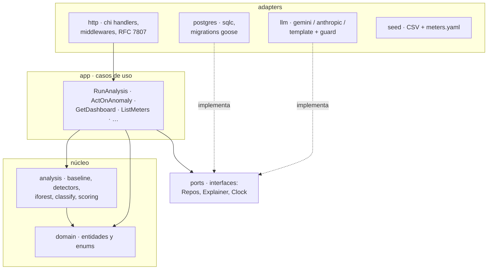
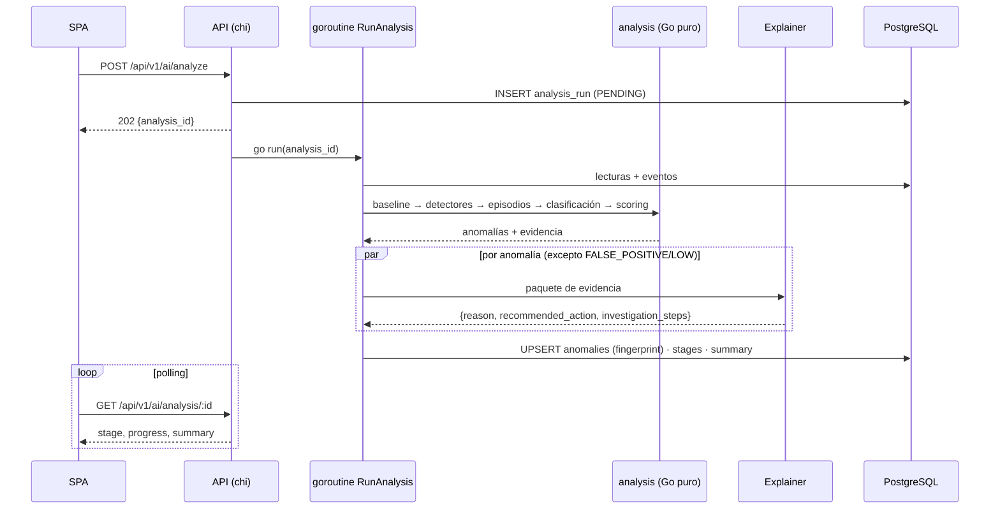
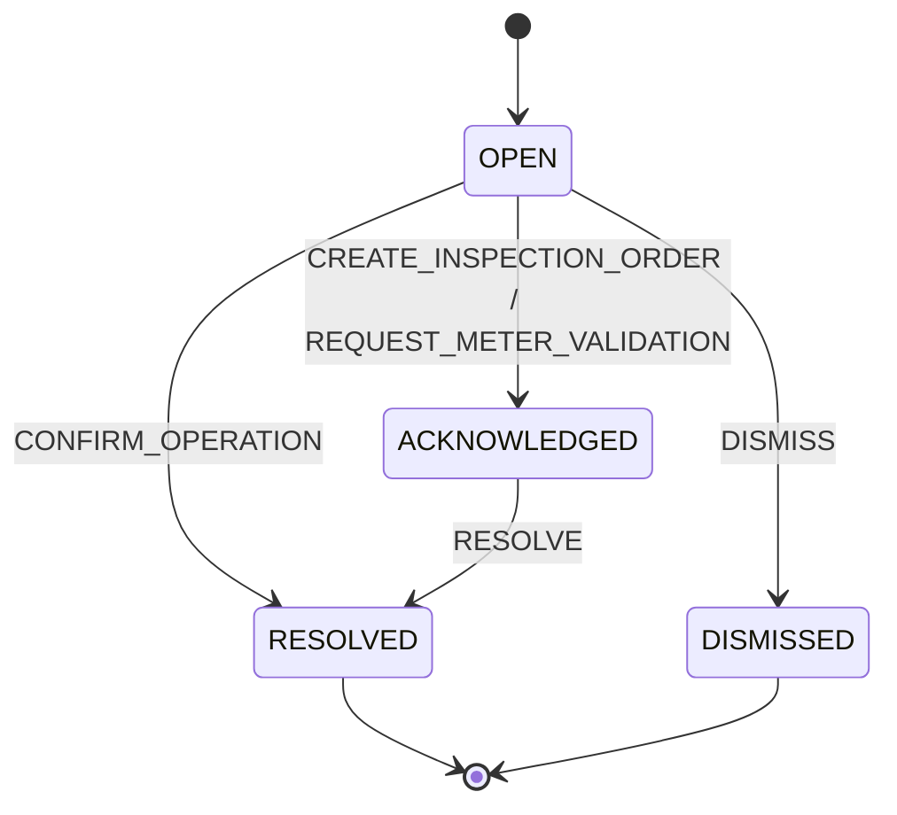

# Voltia: documento de arquitectura

> **AI Energy Management Platform**, MVP para la prueba técnica *Backend + Frontend + Data + IA*.
> Estado: **aprobado** · Fecha: 2026-09-23 · Entrega: 2026-09-27

---

## 1. Resumen

Voltia convierte lecturas de medidores eléctricos en **decisiones operativas**: detecta qué se sale del comportamiento esperado, distingue anomalías reales de cambios explicables, falsos positivos y problemas de calidad de datos, las **prioriza**, **explica con evidencia** y permite **actuar** sobre ellas.

Principio rector del diseño:

> **El motor analítico decide; el LLM narra.**
> Detección, clasificación, severidad, prioridad y confianza son **deterministas, reproducibles y testeables**.
> El LLM (Gemini 3.8 Flash) solo redacta la explicación y la recomendación **a partir de un paquete de evidencia estructurada**, con validación anti-alucinación y fallback a plantillas.

### Ciclo que demuestra la solución

```
DATOS → ANÁLISIS → ANOMALÍA → EXPLICACIÓN → PRIORIZACIÓN → ACCIÓN
```

### Preguntas del reto → dónde se responden

| Pregunta | Mecanismo | Pantalla |
|---|---|---|
| ¿Qué está pasando con los medidores? | KPIs, estado derivado por medidor, heatmap medidor × día | Dashboard |
| ¿Qué lecturas se salen de lo esperado? | Baseline horario robusto + detectores D1 a D7 | Medidores / Detalle |
| ¿Real, explicable o calidad de datos? | Clasificador determinista + correlación con eventos + chequeo físico | Anomalías IA |
| ¿Cuál investigar primero? | Severidad + score de prioridad 0 a 100 | Anomalías IA / Dashboard |
| ¿Por qué la IA llegó a esa conclusión? | Evidencia por detector, desglose de confianza y prioridad, narrativa del LLM | Investigación |
| ¿Qué acción recomienda? | `recommended_action` + botón de acción contextual + historial | Investigación |

---

## 2. Restricciones y alcance

| Aspecto | Decisión |
|---|---|
| Plazo | 4 días (24 a 27 sep 2026), 1 desarrollador, desarrollo asistido por IA |
| Lenguaje backend | **Go** (requisito del reto) |
| Ejecución | `docker compose up` (un comando). Deploy en nube: **fuera de alcance** de esta entrega |
| Demo | **Grabada**, 5 a 10 min |
| Datos | `readings.csv` (4.032 lecturas, 12 medidores, 14 días, horarias) y `events.csv` (4 eventos) |
| Ground truth | `expected_results.csv` **no existe en el sistema** (ni repo, ni seed, ni prompts) |
| Zona horaria | Timestamps del CSV interpretados en `America/Bogota`; API en ISO-8601 UTC |

---

## 3. Vista de contexto y contenedores


**Despliegue local (`docker-compose.yml`):** 2 servicios: `voltia` (imagen multi-stage: build Node → build Go → distroless) y `postgres`. En desarrollo, Vite corre aparte con proxy a la API.

---

## 4. Arquitectura del backend

**Estilo:** monolito modular con **hexagonal ligera** (puertos y adaptadores). El motor de análisis no conoce la base de datos, HTTP ni el LLM.



### Estructura del repositorio

```
voltia/
├── cmd/voltia/main.go             # config, migraciones, seed, wiring, servidor
├── internal/
│   ├── domain/                    # Meter, Reading, Event, Anomaly, AnalysisRun, enums
│   ├── analysis/                  # núcleo: motor puro y testeable
│   │   ├── baseline/  detectors/  iforest/  classify/  scoring/
│   │   └── engine.go              # orquesta las 7 etapas
│   ├── app/                       # casos de uso
│   ├── ports/                     # interfaces
│   ├── adapters/
│   │   ├── http/                  # chi, handlers, auth JWT, errores RFC 7807
│   │   ├── postgres/              # sqlc, queries/*.sql, migrations/
│   │   ├── llm/                   # gemini/, anthropic/, template/, guard.go
│   │   └── seed/                  # CSV + meters.yaml
│   └── config/
├── web/                           # React + Vite + TS
├── data/                          # readings.csv, events.csv
├── api/openapi.yaml
├── docs/                          # architecture.md, analysis-engine.md, adr/
├── Dockerfile · docker-compose.yml · Makefile · .env.example · README.md
```

### Tecnologías

| Capa | Elección |
|---|---|
| HTTP | `chi` (idiomático, compatible con `net/http`, middlewares) |
| Persistencia | PostgreSQL · `pgx` · `sqlc` · migraciones `goose` |
| Auth | JWT en cookie `HttpOnly; SameSite=Lax`, usuario demo con bcrypt |
| LLM | SDK oficial `google.golang.org/genai` (Gemini) · `anthropic-sdk-go` (Claude) |
| Frontend | React · Vite · TypeScript · Tailwind · shadcn/ui · ECharts · TanStack Query · React Router |
| Calidad | `golangci-lint` · ESLint + Prettier · GitHub Actions · Makefile · skills obligatorias: antislop completo, `git-commit-master` y `git-ramas` (ver §11.1) |

---

## 5. Motor de análisis

### 5.1 Pipeline (7 etapas, asíncrono)

```
Lecturas → Baseline → Detección → Correlación → Eventos → Explicación → Recomendación
```

`POST /ai/analyze` crea un `analysis_run` (`PENDING`), responde **202** y lanza una goroutine que avanza etapa por etapa guardando progreso. El frontend hace **polling** (~800 ms) a `GET /ai/analysis/:id`. Cada etapa tiene una pausa visual mínima (~300 ms) para que el stepper sea legible en la demo.



### 5.2 Baseline

- **Perfil de 24 horas** por medidor y por variable (kWh, V, A, FP).
- **Mediana + MAD** (robusto a paradas y picos). Z robusto: `z = (x − mediana) / (1,4826 · MAD)`.
- **Piso de tolerancia:** la dispersión efectiva es como mínimo el 5% de la mediana (evita z enormes en medidores muy estables).
- **Ventana de referencia** configurable (default: los primeros 7 días), **excluyendo** horas con eventos conocidos o que fallan el chequeo físico.
- **Variación (KPI):** promedio diario de los **últimos 2 días** frente al baseline diario (suma del perfil horario).
- Se recalcula en cada análisis (no se persiste); la evidencia de cada anomalía guarda los valores usados.

Ejemplo real (M-109): baseline diario ≈ **1.048 kWh**, reciente ≈ **2.201 kWh/día** → **+110%**.

### 5.3 Detectores (emiten señales con evidencia; no deciden el tipo)

| # | Detector | Regla (umbrales configurables) |
|---|---|---|
| D1 | Cambio persistente | ≥ 6 h consecutivas con \|z\| > 3 en el mismo sentido |
| D2 | Spike / caída brusca | racha de 1 a 5 h con \|z\| > 4 que vuelve a lo normal |
| D3 | Outlier | lectura aislada con \|z\| > 5 en cualquier variable |
| D4 | Patrón horario anormal | correlación del perfil diario con el baseline < 0,8 o relación noche/día fuera de rango |
| D5 | Relación eléctrica anómala | caída de FP > 0,1, corriente que sube más que el consumo, V baja con I alta |
| D6 | Calidad de datos | coherencia física `kWh ≈ V·I·FP/1000` fuera de ±25%; V fuera de ±8% de 220 V con retorno inmediato; valores "de catálogo" repetidos; huecos/duplicados; rangos imposibles |
| D7 | Isolation Forest | score multivariable sobre `[z_kWh, z_V, z_I, z_FP, log(ratio_físico)]`; semilla fija; atribución por variable (profundidad de corte). **Corrobora y alimenta la confianza; no decide tipo ni severidad** |

Validación preliminar de D7 sobre el dataset (prototipo): M-109 score máx 0,79 (1.º), M-112 0,78, M-104 0,68, M-106 0,66; los 8 medidores sanos ≤ 0,56 con **0 lecturas > 0,6**.

### 5.4 Episodios y clasificación

**Episodio:** señales del mismo medidor solapadas o a < 6 h entre sí → **una anomalía** (inicio, fin/en curso, variables afectadas, evidencia).

**Árbol de decisión (determinista):**

```
1. ¿La mayoría de lecturas del episodio fallan D6?           → DATA_QUALITY
2. ¿Hay evento EXPLICATIVO compatible (mismo medidor, ±6 h del inicio, dirección coherente)?
     a. SCHEDULED_OUTAGE + caída + duración ≤ evento (+margen) → FALSE_POSITIVE
     b. OPERATIONAL_CHANGE + aumento                          → EXPLAINABLE_ANOMALY
3. Sin evento explicativo                                     → REAL_ANOMALY
```

**Reglas de seguridad:**
1. Un evento `UNKNOWN` **nunca** explica nada (M-109 tiene uno: *"No operational event reported"*).
2. Un evento `DATA_QUALITY` solo **corrobora** (sube la confianza); la clasificación sale del chequeo físico.
3. Un evento explicativo **no perdona** señales eléctricas anómalas (D5) → el episodio pasa a `REAL_ANOMALY`.

### 5.5 Severidad

| Tipo | HIGH | MEDIUM | LOW |
|---|---|---|---|
| `REAL_ANOMALY` | variación ≥ 50% **o** señales D5 | 20 a 50% | < 20% |
| `DATA_QUALITY` | persistente (≥ 5 lecturas inválidas o en curso) | 2 a 4 lecturas | 1 aislada |
| `EXPLAINABLE_ANOMALY` | no aplica | variación ≥ 20% | < 20% |
| `FALSE_POSITIVE` | no aplica | no aplica | siempre |

### 5.6 Prioridad (0 a 100, para ordenar)

```
prioridad = severidad (HIGH 50 · MEDIUM 25 · LOW 5)
          + tipo      (REAL 25 · DATA_QUALITY 15 · EXPLAINABLE 5 · FP 0)
          + impacto   (0 a 15, proporcional a kWh en exceso)
          + vigencia  (+10 si sigue en curso)
```

### 5.7 Confianza

Índice de **solidez de la evidencia** (no es una probabilidad calibrada: no hay datos etiquetados disponibles).

| Componente | Peso | Mide |
|---|---|---|
| Coincidencia de detectores | 35% | detectores independientes que coinciden (incluye D7) |
| Fuerza de la señal | 30% | magnitud del z y horas de persistencia |
| Claridad de clasificación | 25% | qué tan limpia fue la decisión de tipo (ajuste del evento, ausencia de eventos, % de lecturas incoherentes) |
| Integridad de datos | 10% | % de lecturas válidas (no aplica a `DATA_QUALITY`) |

Acotado a **[0,50 a 0,99]**. Bandas: Alta ≥ 0,85 · Media/Alta 0,75 a 0,85 · Media 0,60 a 0,75 · Baja < 0,60.
KPI agregado: promedio **ponderado por severidad** de las anomalías del último análisis.

### 5.8 Estado del medidor (derivado, no persistido)

- **Critical:** tiene una `REAL_ANOMALY` HIGH abierta.
- **Alert:** tiene una anomalía abierta MEDIUM+ que no es FP, o una `DATA_QUALITY`.
- **OK:** sin anomalías abiertas o solo falsos positivos.

### 5.9 Resultado esperado sobre el dataset (verificado por test de regresión)

| Medidor | Evidencia principal | Tipo | Severidad | Estado |
|---|---|---|---|---|
| **M-109** | +110% desde 12-sep 14:00, I ×2, FP 0,94 → 0,73, sin evento explicativo | `REAL_ANOMALY` | HIGH · **prioridad #1** | Critical |
| **M-112** | kWh estable; 16 lecturas desde 13-sep con V 202/240 y FP 0,58/0,72/0,98 físicamente incoherentes | `DATA_QUALITY` | HIGH | Alert |
| **M-104** | +47% desde 11-sep, FP estable, coincide con nueva línea productiva | `EXPLAINABLE_ANOMALY` | MEDIUM | Alert |
| **M-106** | caída de 12 h el 8-sep, coincide exactamente con parada programada | `FALSE_POSITIVE` | LOW | OK |
| Resto (8) | sin desviaciones | no aplica | no aplica | OK |

> Estos asserts se derivan de la tabla pública de la sección 9 del reto, no de `expected_results.csv`.

---

## 6. Capa de IA generativa (Explainer)

**Puerto** `Explainer` con adaptadores intercambiables vía `LLM_PROVIDER`:

| Proveedor | Uso |
|---|---|
| `gemini` (default) | **Gemini 3.8 Flash**, capa gratuita de Google AI Studio (`GEMINI_API_KEY`) |
| `anthropic` | API de Claude (`ANTHROPIC_API_KEY`), mismo prompt y esquema |
| `template` | Plantillas deterministas; fallback automático sin key, ante error, timeout (~20 s) o cuota (429) |

**Reglas de integración:**
1. **Entrada:** solo el paquete de evidencia estructurada. Prompt: *usar únicamente esos datos; no cambiar tipo, severidad ni confianza; español para un operador de mantenimiento*.
2. **Salida estructurada** (JSON Schema): `{summary, reason, recommended_action, investigation_steps[], evidence_refs[]}`.
3. **Guarda de números:** cada número del texto debe existir en la evidencia (con tolerancia de redondeo); si no, se descarta y se usa la plantilla.
4. **Paralelismo:** una llamada por anomalía en goroutines; `FALSE_POSITIVE`/LOW usa plantilla directamente.
5. **Caché** por hash de la evidencia (`explanation_cache`): re-ejecutar es instantáneo y estable.
6. **Transparencia en la UI:** badge *"Clasificación: motor analítico · Explicación: Gemini / plantilla"*.

> Nota de privacidad: en la capa gratuita de Gemini el contenido puede usarse para mejorar productos de Google. Aceptable para este dataset de prueba; en producción se usaría la capa de pago con opt-out.

---

## 7. Modelo de datos

Convención **snake_case** en base de datos, JSON y parámetros de URL.

```mermaid
erDiagram
    users ||--o{ anomaly_actions : realiza
    meters ||--o{ readings : tiene
    meters ||--o{ events : tiene
    meters ||--o{ anomalies : tiene
    anomalies ||--o{ anomaly_actions : historial
    analysis_runs ||--o{ anomalies : "last_analysis_id"

    users { uuid id PK; text email UK; text password_hash; text name; timestamptz created_at }
    meters { uuid id PK; text meter_id UK; text name; text location; timestamptz created_at }
    readings { bigint id PK; text meter_id FK; timestamptz ts; numeric consumption_kwh; numeric voltage_v; numeric current_a; numeric power_factor; text status }
    events { uuid id PK; text meter_id FK; timestamptz ts; text type; text description }
    analysis_runs { uuid id PK; text status; text current_stage; jsonb stages; jsonb summary; jsonb params; timestamptz started_at; timestamptz finished_at }
    anomalies { uuid id PK; text meter_id FK; text fingerprint UK; text type; text severity; numeric confidence; jsonb confidence_breakdown; int priority; jsonb priority_breakdown; timestamptz episode_start; timestamptz episode_end; bool ongoing; jsonb evidence; text reason; text recommended_action; jsonb investigation_steps; text explanation_source; text explanation_model; text status; timestamptz detected_at; uuid last_analysis_id }
    anomaly_actions { uuid id PK; uuid anomaly_id FK; uuid user_id FK; text action; text note; text from_status; text to_status; timestamptz created_at }
    explanation_cache { text evidence_hash PK; text provider; text model; jsonb payload; timestamptz created_at }
```

**Decisiones:**
- `readings`: `UNIQUE(meter_id, ts)` + índice `(meter_id, ts)`; seed idempotente con `ON CONFLICT DO NOTHING`.
- Evidencia y desgloses en **jsonb** (formas heterogéneas por detector; siempre se leen completos).
- **Estado del medidor derivado** de anomalías abiertas (sin sincronización ni doble fuente de verdad).
- **Baseline y señales crudas no se persisten**; quedan resumidos en `evidence`.
- `analysis_runs.params` guarda los umbrales usados → **reproducibilidad**.
- `anomalies.fingerprint` = medidor + tipo + inicio de episodio → **deduplicación** al re-ejecutar (se conserva estado e historial).
- `meters.yaml` aporta nombres y ubicaciones realistas (contexto industrial colombiano).

### Ciclo de vida de la anomalía



| Tipo | Acción principal |
|---|---|
| `REAL_ANOMALY` | Crear orden de inspección |
| `DATA_QUALITY` | Solicitar validación del medidor |
| `EXPLAINABLE_ANOMALY` | Confirmar operación |
| `FALSE_POSITIVE` | Descartar |

---

## 8. API REST

Base `/api/v1` · JSON snake_case · fechas ISO-8601 UTC · errores **RFC 7807** (`application/problem+json`) · documentación en `api/openapi.yaml` + Swagger UI en `/api/docs`. Todo lo que no es `/api` sirve la SPA.

| Método | Ruta | Descripción |
|---|---|---|
| POST | `/auth/login` · `/auth/logout` | Sesión con cookie httpOnly |
| GET | `/auth/me` | Usuario actual |
| GET | `/dashboard/summary` ★ | KPIs, último análisis, top anomalías |
| GET | `/meters` ★ | `?status=ok,alert,critical&q=&sort=consumption\|variation\|severity&order=` |
| GET | `/meters/:meter_id` ★ | Consumo reciente, baseline, variación, estado, eléctricas, anomalías abiertas |
| GET | `/meters/:meter_id/readings` ★ | `?from&to&resolution=hour\|day&include=baseline` |
| GET | `/meters/:meter_id/events` | Eventos del medidor |
| GET | `/anomalies` ★ | `?type&severity&status&meter_id`, orden por prioridad |
| GET | `/anomalies/:id` ★ | Evidencia, desgloses, explicación, eventos relacionados, historial |
| POST | `/anomalies/:id/actions` | `{action, note}` → nuevo estado + estado del medidor |
| POST | `/ai/analyze` ★ | **202** `{analysis_id}` |
| GET | `/ai/analysis/:id` ★ | Estado, etapa, progreso, resumen |
| GET | `/ai/analysis/latest` | Último análisis |
| GET | `/healthz` | Salud |

★ = endpoint mínimo del reto. La respuesta de anomalía incluye en su nivel superior los campos exactos del ejemplo del reto: `meter_id, anomaly, type, severity, confidence, reason, recommended_action`.

---

## 9. Frontend y UX

**Dirección visual:** "centro de control" oscuro por defecto (con modo claro), acento ámbar eléctrico, colores semánticos consistentes (Critical rojo · Alert ámbar · OK verde · Calidad de datos violeta · Falso positivo gris). UI en **español (es-CO)**: `2.180 kWh`, `+103,7%`. El diseño y los textos siguen todas las skills de antislop (§11.2), a partir de un `DESIGN.md` del dueño del proyecto.

**Layout:** sidebar (Dashboard · Medidores · Anomalías IA · Análisis · API docs) + topbar con búsqueda global y botón **▶ Run AI Analysis** siempre visible (abre panel lateral con stepper de 7 etapas).

| Pantalla | Contenido clave |
|---|---|
| Login | Pre-rellenado + "Entrar como demo" |
| Dashboard | 6 KPIs del reto, tarjeta "Requiere atención" (top 3), consumo del período, heatmap medidor × día |
| Medidores | Tabla con chips de filtro, búsqueda, orden y sparkline de 14 días |
| Detalle | Consumo/baseline/variación/estado; gráfica ECharts con **banda de baseline**, marcadores de eventos y zona anómala; pestañas V/I/FP |
| Anomalías IA | Medidor · Tipo · Severidad · Confianza · Acción, ordenado por prioridad |
| Investigación | Narrativa IA + badge de fuente, variables antes → ahora, zoom del episodio, eventos y cómo se trataron, desglose de confianza y prioridad, evidencia por detector, acción + historial |
| Análisis | Stepper en vivo, resumen ("4 anomalías · 2 prioritarias"), historial de ejecuciones |

**Estado inicial sin análisis:** el dashboard invita a ejecutar Run AI Analysis, para que la demo muestre el antes y el después.

---

## 10. Seguridad y configuración

- JWT firmado (HS256, `JWT_SECRET`), cookie `HttpOnly; SameSite=Lax` (y `Secure` fuera de local); middleware protege todo `/api/v1` excepto login y healthz.
- Contraseña del usuario demo con bcrypt.
- Secretos solo por variables de entorno (`.env` en `.gitignore`; `.env.example` documentado).
- Sin CORS en producción (SPA embebida, mismo origen).

| Variable | Default | Uso |
|---|---|---|
| `DATABASE_URL` | compose | Postgres |
| `JWT_SECRET` | sin valor por defecto | Firma de sesión |
| `LLM_PROVIDER` | `gemini` | `gemini` · `anthropic` · `template` |
| `LLM_MODEL` | `gemini-3.8-flash` | Modelo del proveedor |
| `GEMINI_API_KEY` / `ANTHROPIC_API_KEY` | vacío | Sin key → plantillas |
| `PLANT_TZ` | `America/Bogota` | Zona de los CSV |
| `ANALYSIS_*` | ver `config` | Umbrales, ventanas y pesos del motor |

---

## 11. Testing y calidad

| Nivel | Qué | Herramienta |
|---|---|---|
| 1 (clave) | **Regresión sobre el dataset real**: los 4 casos + 8 sanos + inicio de episodio de M-109 | `go test` |
| 2 | Unitarios del motor: baseline, D1 a D7, clasificador y reglas de seguridad, scoring, determinismo IF, guarda de números | `go test` table-driven |
| 3 | API: códigos, filtros, auth, RFC 7807 | `httptest` + repos fake |
| 3+ | 3 a 4 tests críticos contra Postgres real: filtros/orden, seed idempotente, dedupe por fingerprint | Testcontainers |
| 4 | Utilidades y componentes clave del frontend | Vitest |
| stretch | 1 smoke e2e del flujo de la demo, solo local | Playwright |

CI (GitHub Actions): lint Go/TS → tests Go → build web → build imagen Docker. `Makefile`: `make up`, `make dev`, `make test`, `make lint`.

### 11.1 Skills obligatorias

Tres skills se aplican al pie de la letra durante todo el proyecto. Ninguna se adapta, se resume ni se reemplaza por un paso manual. Si una instrucción del proyecto choca con una skill, se detiene el trabajo y se consulta al dueño del proyecto antes de seguir.

| Skill | Ámbito | Sección |
|---|---|---|
| antislop, con todas sus skills | Planificación, código, UI, textos y entrega | §11.2 |
| `git-commit-master` | Cada commit, sin excepción | §11.3 |
| `git-ramas` | Cada rama: feature, bugfix y hotfix | §11.4 |

### 11.2 antislop: todas sus skills, en todas las fases

Se usan las seis skills del plugin antislop en todas las fases del proyecto, no solo en la de UI:

| Skill | Qué controla |
|---|---|
| `antislop` (núcleo) | Filtro base, reglas R-01 a R-38 y el Delivery Gate. Se carga al empezar cada sesión de trabajo |
| `antislop-ui` | Color, layout, componentes, decoración y animación |
| `antislop-human` | Contraste (con su verificador), teclado, foco y estados vacío, carga y error |
| `antislop-copywriting` | Todo texto para personas: UI, README, ADRs, este documento, guion de la demo, prompt de Gemini y plantillas de explicación |
| `antislop-code` | Comentarios del código Go y TypeScript |
| `antislop-layoutmobile` | Adaptación de escritorio a tablet y móvil |

Reglas de aplicación:

- **Modo:** antislop se aplica durante el trabajo (modo 1): las reglas rigen mientras se escribe, no después.
- **Cierre:** cada entrega pasa el Delivery Gate completo (bloques 1 a 4) con el reporte PASS/FAIL y su evidencia. Un FAIL bloquea la entrega.
- **Dirección de diseño (R-37):** la UI no se empieza sin un `DESIGN.md` escrito por el dueño del proyecto, con identidad, paleta, tipografía y los diales ENERGY, RHYTHM y MOTION.
- **Activos (R-23):** logo, iconografía e imágenes se confirman con el dueño antes de crearse. Hasta entonces se usan placeholders marcados como tales.
- **Textos:** ningún texto lleva guion largo (R-02), cifras sin fuente (R-17) ni vocabulario vacío de IA (R-16).

Criterios de aceptación:

- Todos los pares de color texto/fondo de ambos temas pasan el verificador de contraste (WCAG AA como mínimo).
- El flujo de la demo se recorre entero con teclado y el foco siempre se ve.
- Las explicaciones de la IA y las plantillas se leen como escritas por un ingeniero de mantenimiento: concretas, con cifras de la evidencia y sin muletillas de IA.
- Ningún commit agrega comentarios que solo repitan lo que hace el código.

### 11.3 Commits: `git-commit-master`

Todo commit se crea con la skill `git-commit-master`. Nadie escribe mensajes de commit a mano.

| Regla | Detalle |
|---|---|
| Formato | Conventional Commits: `tipo(alcance): descripción`, en inglés y en imperativo |
| Tipos | Los de la skill: `feat`, `fix`, `refactor`, `docs`, `style`, `perf`, `chore`, `test` |
| Título | Máximo 50 caracteres, sin punto final |
| Cuerpo | Explica la intención y el impacto del cambio |
| Autoría | **Sin coautor:** ningún commit lleva `Co-Authored-By` ni otro pie de autoría |
| Seguridad | La skill cancela el commit si detecta secretos. Nunca se versionan `.env` ni `expected_results.csv` |
| Tamaño | Si el diff pasa de 500 líneas, se divide en commits más atómicos |

### 11.4 Ramas: `git-ramas`

Todas las ramas siguen los flujos de la skill `git-ramas`, paso por paso y sin saltarse ninguno.

- **Feature y bugfix:** la rama de trabajo sale de la release vigente (la `release/v*` de mayor versión). Al terminar se sube la rama, se crea la rama temporal `-dev`, se trae `dev` sobre ella y se sube solo esa rama temporal.
- **Hotfix:** la rama sale de `main` y genera dos ramas temporales, `-dev` y `-release`, una por cada destino.
- **Nomenclatura:** `feature/`, `bugfix/` o `hotfix/` más una descripción de 3 o 4 palabras.
- **Pull Requests:** los abre el dueño del proyecto desde GitHub. Nunca se crean por comandos.
- **Ramas protegidas:** nunca se hace push directo a `main`, `dev` ni a una `release/v*`.
- **Push:** se confirma con el dueño antes de cada `git push`.
- **Conflictos:** si aparecen al integrar con `dev` o con la release, el proceso se detiene hasta que el dueño los revise.

Repositorio: `github.com/m0ntbl4ck/voltia`.

---

## 12. Plan de ejecución

| Día | Meta | Entregable verificable |
|---|---|---|
| **Jue 24** | El cerebro funciona | Scaffold, migraciones, seed, motor completo; **test de regresión en verde** |
| **Vie 25** | La API y la IA hablan | API completa + OpenAPI; Explainer (plantillas → Gemini) + guarda + caché; Isolation Forest |
| **Sáb 26** | Voltia se ve como producto | Las 7 pantallas y el flujo de la demo completo con `docker compose up` |
| **Dom 27** | Entrega | Pulido, tests restantes, adaptador Claude, README + ADRs, prueba en limpio sin key, **grabación de la demo** |

Todos los días aplican las skills obligatorias de §11.1. Cada entrega diaria cierra con el Delivery Gate de antislop.

**Orden de recorte si hay atraso:** Playwright → adaptador Claude → modo claro → Isolation Forest → D4.
**Nunca se recortan:** test de regresión, flujo de la demo, fallback a plantillas, README.

---

## 13. Guion de demo (grabada, 5 a 10 min)

1. **Login** como demo → dashboard vacío: "aún no hay análisis".
2. **Contexto:** 12 medidores, 14 días; M-109 aparece con consumo alto en la tabla.
3. **Detalle M-109:** la línea se sale de la banda de baseline el 12-sep 14:00; FP cae.
4. **▶ Run AI Analysis:** stepper de 7 etapas → *"4 anomalías detectadas · 2 requieren atención prioritaria"*.
5. **Anomalías IA:** M-109 (Real/High) primero; M-112 (Calidad/High); M-104 (Explicable/Medium); M-106 (Falso positivo/Low, no escalar).
6. **Investigación M-109:** narrativa de Gemini, evidencia, desglose de confianza (0,96), evento UNKNOWN tratado como "sin explicación".
7. **M-112 y M-106** en 30 s cada uno: por qué *no* son anomalías reales.
8. **Acción:** "Crear orden de inspección" → el dashboard baja de 2 a 1 alta prioridad pendiente.
9. **Cierre técnico:** arquitectura, `go test` de regresión en verde, Swagger.

---

## 14. Limitaciones conocidas y trabajo futuro

- La confianza es un índice de solidez de evidencia, **no una probabilidad calibrada** (sin datos etiquetados).
- Baseline con solo 7 días de referencia: no separa días laborales de fines de semana.
- Umbrales ajustados a un dataset pequeño; en producción se calibrarían con historial y feedback de operadores (las acciones DISMISS/RESOLVE son la semilla de ese feedback).
- Análisis en proceso (goroutine); a escala se movería a una cola/worker.
- Futuro: deploy en nube, SSE para progreso, multi-tenant y roles, notificaciones, ingesta en streaming.

---

## 15. Registro de decisiones (→ `docs/adr/`)

| ADR | Decisión |
|---|---|
| 0001 | Go, monolito modular con hexagonal ligera |
| 0002 | PostgreSQL + sqlc + goose; estado del medidor derivado |
| 0003 | Motor determinista decide, LLM narra, plantillas como fallback |
| 0004 | Baseline horario robusto (mediana + MAD) con referencia excluyente |
| 0005 | Detectores por reglas + Isolation Forest como corroborador |
| 0006 | Clasificación por árbol con reglas de seguridad sobre eventos |
| 0007 | Gemini 3.8 Flash como proveedor por defecto, Claude intercambiable |
| 0008 | SPA React embebida en el binario; polling para el progreso |
| 0009 | snake_case de punta a punta y RFC 7807 |
