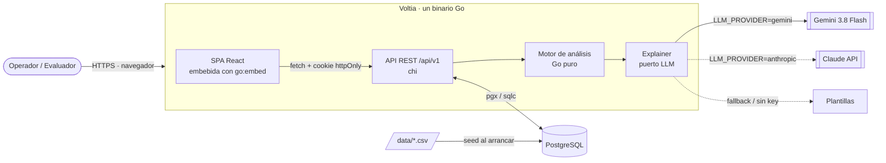
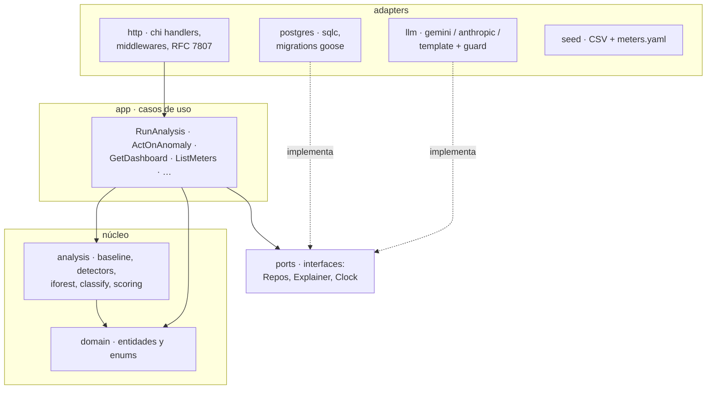
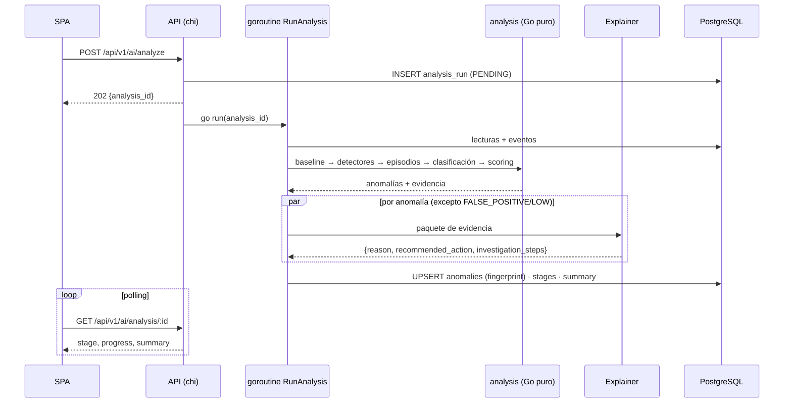

# Voltia: documento de arquitectura

> **AI Energy Management Platform**, MVP para la prueba técnica *Backend + Frontend + Data + IA*.
> Estado: **aprobado** · Fecha: 2026-09-23 · Entrega: 2026-09-27

---

## 1. Resumen

Voltia convierte lecturas de medidores eléctricos en **decisiones operativas**: detecta qué se sale del comportamiento esperado, distingue anomalías reales de cambios explicables, falsos positivos y problemas de calidad de datos, las **prioriza**, **explica con evidencia** y permite **actuar** sobre ellas.

Principio rector del diseño:

> **El motor analítico decide; el LLM narra.**
> Detección, clasificación, severidad, prioridad y confianza son **deterministas, reproducibles y testeables**.
> El LLM (Gemini 3.8 Flash) solo redacta la explicación y la recomendación **a partir de un paquete de evidencia estructurada**, con validación anti-alucinación y fallback a plantillas.

### Ciclo que demuestra la solución

```
DATOS → ANÁLISIS → ANOMALÍA → EXPLICACIÓN → PRIORIZACIÓN → ACCIÓN
```

### Preguntas del reto → dónde se responden

| Pregunta | Mecanismo | Pantalla |
|---|---|---|
| ¿Qué está pasando con los medidores? | KPIs, estado derivado por medidor, heatmap medidor × día | Dashboard |
| ¿Qué lecturas se salen de lo esperado? | Baseline horario robusto + detectores D1 a D7 | Medidores / Detalle |
| ¿Real, explicable o calidad de datos? | Clasificador determinista + correlación con eventos + chequeo físico | Anomalías IA |
| ¿Cuál investigar primero? | Severidad + score de prioridad 0 a 100 | Anomalías IA / Dashboard |
| ¿Por qué la IA llegó a esa conclusión? | Evidencia por detector, desglose de confianza y prioridad, narrativa del LLM | Investigación |
| ¿Qué acción recomienda? | `recommended_action` + botón de acción contextual + historial | Investigación |

---

## 2. Restricciones y alcance

| Aspecto | Decisión |
|---|---|
| Plazo | 4 días (24 a 27 sep 2026), 1 desarrollador, desarrollo asistido por IA |
| Lenguaje backend | **Go** (requisito del reto) |
| Ejecución | `docker compose up` (un comando). Deploy en nube: **fuera de alcance** de esta entrega |
| Demo | **Grabada**, 5 a 10 min |
| Datos | `readings.csv` (4.032 lecturas, 12 medidores, 14 días, horarias) y `events.csv` (4 eventos) |
| Ground truth | `expected_results.csv` **no existe en el sistema** (ni repo, ni seed, ni prompts) |
| Zona horaria | Timestamps del CSV interpretados en `America/Bogota`; API en ISO-8601 UTC |

---

## 3. Vista de contexto y contenedores



**Despliegue local (`docker-compose.yml`):** 2 servicios: `voltia` (imagen multi-stage: build Node → build Go → distroless) y `postgres`. En desarrollo, Vite corre aparte con proxy a la API.

---

## 4. Arquitectura del backend

**Estilo:** monolito modular con **hexagonal ligera** (puertos y adaptadores). El motor de análisis no conoce la base de datos, HTTP ni el LLM.



### Estructura del repositorio

```
voltia/
├── cmd/voltia/main.go             # config, migraciones, seed, wiring, servidor
├── internal/
│   ├── domain/                    # Meter, Reading, Event, Anomaly, AnalysisRun, enums
│   ├── analysis/                  # núcleo: motor puro y testeable
│   │   ├── baseline/  detectors/  iforest/  classify/  scoring/
│   │   └── engine.go              # orquesta las 7 etapas
│   ├── app/                       # casos de uso
│   ├── ports/                     # interfaces
│   ├── adapters/
│   │   ├── http/                  # chi, handlers, auth JWT, errores RFC 7807
│   │   ├── postgres/              # sqlc, queries/*.sql, migrations/
│   │   ├── llm/                   # gemini/, anthropic/, template/, guard.go
│   │   └── seed/                  # CSV + meters.yaml
│   └── config/
├── web/                           # React + Vite + TS
├── data/                          # readings.csv, events.csv
├── api/openapi.yaml
├── docs/                          # architecture.md, analysis-engine.md, adr/
├── Dockerfile · docker-compose.yml · Makefile · .env.example · README.md
```

### Tecnologías

| Capa | Elección |
|---|---|
| HTTP | `chi` (idiomático, compatible con `net/http`, middlewares) |
| Persistencia | PostgreSQL · `pgx` · `sqlc` · migraciones `goose` |
| Auth | JWT en cookie `HttpOnly; SameSite=Lax`, usuario demo con bcrypt |
| LLM | SDK oficial `google.golang.org/genai` (Gemini) · `anthropic-sdk-go` (Claude) |
| Frontend | React · Vite · TypeScript · Tailwind · shadcn/ui · ECharts · TanStack Query · React Router |
| Calidad | `golangci-lint` · ESLint + Prettier · GitHub Actions · Makefile · skills obligatorias: antislop completo, `git-commit-master` y `git-ramas` (ver §11.1) |

---

## 5. Motor de análisis

### 5.1 Pipeline (7 etapas, asíncrono)

```
Lecturas → Baseline → Detección → Correlación → Eventos → Explicación → Recomendación
```

`POST /ai/analyze` crea un `analysis_run` (`PENDING`), responde **202** y lanza una goroutine que avanza etapa por etapa guardando progreso. El frontend hace **polling** (~800 ms) a `GET /ai/analysis/:id`. Cada etapa tiene una pausa visual mínima (~300 ms) para que el stepper sea legible en la demo.



### 5.2 Baseline

- **Perfil de 24 horas** por medidor y por variable (kWh, V, A, FP).
- **Mediana + MAD** (robusto a paradas y picos). Z robusto: `z = (x − mediana) / (1,4826 · MAD)`.
- **Piso de tolerancia:** la dispersión efectiva es como mínimo el 5% de la mediana (evita z enormes en medidores muy estables).
- **Ventana de referencia** configurable (default: los primeros 7 días), **excluyendo** horas con eventos conocidos o que fallan el chequeo físico.
- **Variación (KPI):** promedio diario de los **últimos 2 días** frente al baseline diario (suma del perfil horario).
- Se recalcula en cada análisis (no se persiste); la evidencia de cada anomalía guarda los valores usados.

Ejemplo real (M-109): baseline diario ≈ **1.048 kWh**, reciente ≈ **2.201 kWh/día** → **+110%**.

### 5.3 Detectores (emiten señales con evidencia; no deciden el tipo)

| # | Detector | Regla (umbrales configurables) |
|---|---|---|
| D1 | Cambio persistente | ≥ 6 h consecutivas con \|z\| > 3 en el mismo sentido |
| D2 | Spike / caída brusca | racha de 1 a 5 h con \|z\| > 4 que vuelve a lo normal |
| D3 | Outlier | lectura aislada con \|z\| > 5 en cualquier variable |
| D4 | Patrón horario anormal | correlación del perfil diario con el baseline < 0,8 o relación noche/día fuera de rango |
| D5 | Relación eléctrica anómala | caída de FP > 0,1, corriente que sube más que el consumo, V baja con I alta |
| D6 | Calidad de datos | coherencia física `kWh ≈ V·I·FP/1000` fuera de ±25%; V fuera de ±8% de 220 V con retorno inmediato; valores "de catálogo" repetidos; huecos/duplicados; rangos imposibles |
| D7 | Isolation Forest | score multivariable sobre `[z_kWh, z_V, z_I, z_FP, log(ratio_físico)]`; semilla fija; atribución por variable (profundidad de corte). **Corrobora y alimenta la confianza; no decide tipo ni severidad** |

Validación preliminar de D7 sobre el dataset (prototipo): M-109 score máx 0,79 (1.º), M-112 0,78, M-104 0,68, M-106 0,66; los 8 medidores sanos ≤ 0,56 con **0 lecturas > 0,6**.

### 5.4 Episodios y clasificación

**Episodio:** señales del mismo medidor solapadas o a < 6 h entre sí → **una anomalía** (inicio, fin/en curso, variables afectadas, evidencia).

**Árbol de decisión (determinista):**

```
1. ¿La mayoría de lecturas del episodio fallan D6?           → DATA_QUALITY
2. ¿Hay evento EXPLICATIVO compatible (mismo medidor, ±6 h del inicio, dirección coherente)?
     a. SCHEDULED_OUTAGE + caída + duración ≤ evento (+margen) → FALSE_POSITIVE
     b. OPERATIONAL_CHANGE + aumento                          → EXPLAINABLE_ANOMALY
3. Sin evento explicativo                                     → REAL_ANOMALY
```

**Reglas de seguridad:**
1. Un evento `UNKNOWN` **nunca** explica nada (M-109 tiene uno: *"No operational event reported"*).
2. Un evento `DATA_QUALITY` solo **corrobora** (sube la confianza); la clasificación sale del chequeo físico.
3. Un evento explicativo **no perdona** señales eléctricas anómalas (D5) → el episodio pasa a `REAL_ANOMALY`.

### 5.5 Severidad

| Tipo | HIGH | MEDIUM | LOW |
|---|---|---|---|
| `REAL_ANOMALY` | variación ≥ 50% **o** señales D5 | 20 a 50% | < 20% |
| `DATA_QUALITY` | persistente (≥ 5 lecturas inválidas o en curso) | 2 a 4 lecturas | 1 aislada |
| `EXPLAINABLE_ANOMALY` | no aplica | variación ≥ 20% | < 20% |
| `FALSE_POSITIVE` | no aplica | no aplica | siempre |

### 5.6 Prioridad (0 a 100, para ordenar)

```
prioridad = severidad (HIGH 50 · MEDIUM 25 · LOW 5)
          + tipo      (REAL 25 · DATA_QUALITY 15 · EXPLAINABLE 5 · FP 0)
          + impacto   (0 a 15, proporcional a kWh en exceso)
          + vigencia  (+10 si sigue en curso)
```

### 5.7 Confianza

Índice de **solidez de la evidencia** (no es una probabilidad calibrada: no hay datos etiquetados disponibles).

| Componente | Peso | Mide |
|---|---|---|
| Coincidencia de detectores | 35% | detectores independientes que coinciden (incluye D7) |
| Fuerza de la señal | 30% | magnitud del z y horas de persistencia |
| Claridad de clasificación | 25% | qué tan limpia fue la decisión de tipo (ajuste del evento, ausencia de eventos, % de lecturas incoherentes) |
| Integridad de datos | 10% | % de lecturas válidas (no aplica a `DATA_QUALITY`) |

Acotado a **[0,50 a 0,99]**. Bandas: Alta ≥ 0,85 · Media/Alta 0,75 a 0,85 · Media 0,60 a 0,75 · Baja < 0,60.
KPI agregado: promedio **ponderado por severidad** de las anomalías del último análisis.

### 5.8 Estado del medidor (derivado, no persistido)

- **Critical:** tiene una `REAL_ANOMALY` HIGH abierta.
- **Alert:** tiene una anomalía abierta MEDIUM+ que no es FP, o una `DATA_QUALITY`.
- **OK:** sin anomalías abiertas o solo falsos positivos.

### 5.9 Resultado esperado sobre el dataset (verificado por test de regresión)

| Medidor | Evidencia principal | Tipo | Severidad | Estado |
|---|---|---|---|---|
| **M-109** | +110% desde 12-sep 14:00, I ×2, FP 0,94 → 0,73, sin evento explicativo | `REAL_ANOMALY` | HIGH · **prioridad #1** | Critical |
| **M-112** | kWh estable; 16 lecturas desde 13-sep con V 202/240 y FP 0,58/0,72/0,98 físicamente incoherentes | `DATA_QUALITY` | HIGH | Alert |
| **M-104** | +47% desde 11-sep, FP estable, coincide con nueva línea productiva | `EXPLAINABLE_ANOMALY` | MEDIUM | Alert |
| **M-106** | caída de 12 h el 8-sep, coincide exactamente con parada programada | `FALSE_POSITIVE` | LOW | OK |
| Resto (8) | sin desviaciones | no aplica | no aplica | OK |

> Estos asserts se derivan de la tabla pública de la sección 9 del reto, no de `expected_results.csv`.

---

## 6. Capa de IA generativa (Explainer)

**Puerto** `Explainer` con adaptadores intercambiables vía `LLM_PROVIDER`:

| Proveedor | Uso |
|---|---|
| `gemini` (default) | **Gemini 3.8 Flash**, capa gratuita de Google AI Studio (`GEMINI_API_KEY`) |
| `anthropic` | API de Claude (`ANTHROPIC_API_KEY`), mismo prompt y esquema |
| `template` | Plantillas deterministas; fallback automático sin key, ante error, timeout (~20 s) o cuota (429) |

**Reglas de integración:**
1. **Entrada:** solo el paquete de evidencia estructurada. Prompt: *usar únicamente esos datos; no cambiar tipo, severidad ni confianza; español para un operador de mantenimiento*.
2. **Salida estructurada** (JSON Schema): `{summary, reason, recommended_action, investigation_steps[], evidence_refs[]}`.
3. **Guarda de números:** cada número del texto debe existir en la evidencia (con tolerancia de redondeo); si no, se descarta y se usa la plantilla.
4. **Paralelismo:** una llamada por anomalía en goroutines; `FALSE_POSITIVE`/LOW usa plantilla directamente.
5. **Caché** por hash de la evidencia (`explanation_cache`): re-ejecutar es instantáneo y estable.
6. **Transparencia en la UI:** badge *"Clasificación: motor analítico · Explicación: Gemini / plantilla"*.

> Nota de privacidad: en la capa gratuita de Gemini el contenido puede usarse para mejorar productos de Google. Aceptable para este dataset de prueba; en producción se usaría la capa de pago con opt-out.

---

